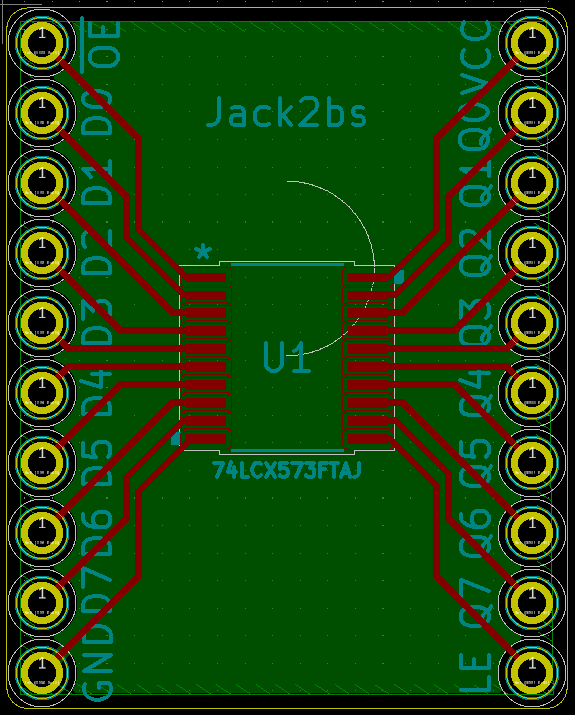
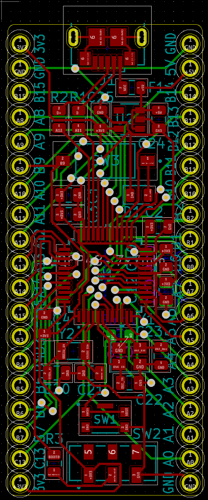
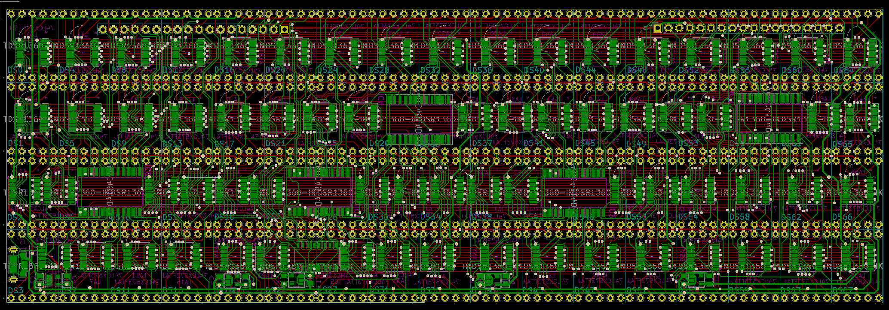
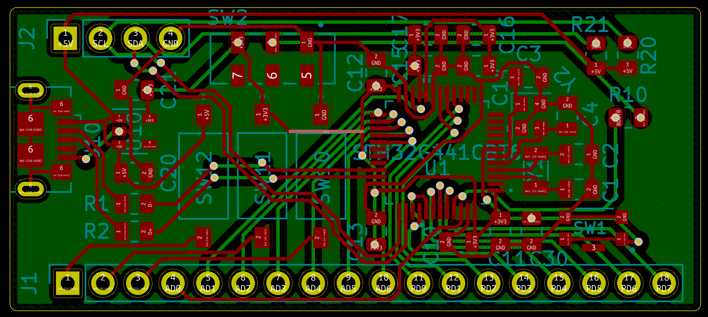
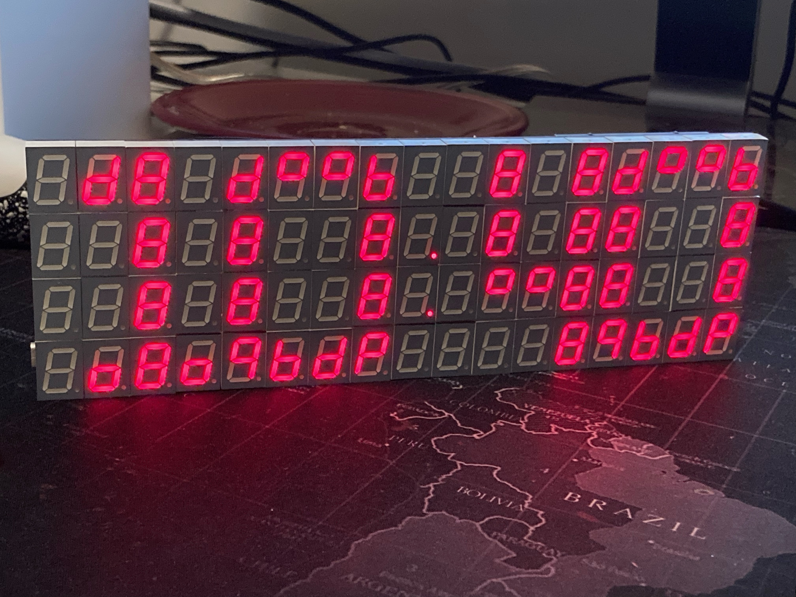

# 
Many Segment Display

A four-digit display, made from 68 seven segment displays! By Jack Toubes. Inspired by [This Hackaday Project](https://hackaday.io/project/169632-7-segment-display-array-clock).

## Overview and conclusions
When I saw the above linked Hackaday project a while back, I thought it was the funniest thing I'd ever seen. But I didn't have the skills or money required to build something like it. Last year, however, when I got to my dorm room and realized that I hadn't brought a clock with me to school, I remembered that Hackaday project and I thought I'd give it a shot. I had looked closely at the original, and I saw some places where I could improve, especially in the cost of the project. In the end the project took me a couple of months of on and off work (dictated by how busy I was with school). This project, like many of my other similar projects, offered me the opportunity to hone my electronic design skills, my ability to learn from datasheets, my ability to program in c and c++, and my ability to work with microcontrollers.

## Improvements from original project
In the original project on *Hackaday*, the LEDs are driven using dedicated LED driver ICs named MAX7219's, each of which could drive 8 seven segment displays. While this option certainly simplifies the board design and project in general, I decided to use 8-bit latches and some address decoders instead. 8 of these 8-bit latches are significantly cheaper than a single LED controller used in the *Hackaday* project, yet can control the same number of LEDs. This solution does require a significant number more pins/data lines, and a much more complicated circuit board, however I consider this worthwhile, considering that my LED driving solution costs $20-$25, whereas 9 of the dedicated LED drivers would cost between $90-$110 dollars. Using shift registers but not dedicated LED drivers would lead to a cost somewhere in between the two options, and could serve as a good compromise, considering that the board design would still be complex, but the number of data lines would be significantly reduced. One issue with the shift registers (and as a consequence also of the LED driver ICs), is that to change a single LED's state, you must update all of them. With my solution, you can change any LED at any time without affecting the others. The actual benefits to this are somewhat limited but could prove consequential in certain applications. One disadvantage with using latches is that they aren't designed to provide high amounts of current, and so (slightly more expensive) low current LEDs had to be chosen. This did however lead to a much less power hungry design than in the *Hackaday* project so perhaps this could also be considered a positive depending on your perspective.

## Parts (prices as of part purchasing)

| Part | Part Number | Manufacturer | Price (Digikey) |  link | Price (Mouser) | link | Quantity |
|--|--|--|--|--|--|--|--|
|Display Parts
| 7-Seg Display | TDSR1360-IK | Vishay Semi | $1.43 for 10 | [Digikey](https://www.digikey.com/en/products/detail/vishay-semiconductor-opto-division/TDSR1360-IK/4074625?s=N4IgTCBcDaIOwA4C0AVAIgZQEoEYDMAbAAxICSA0iALoC%2bQA)| $1.29 for 10 | [Mouser](https://www.mouser.com/ProductDetail/Vishay-Semiconductors/TDSR1360-IK?qs=5csRq1wdUj5b9hoSL0MeOw%3D%3D) | 68+
| 8-bit Latch | 74LCX573FTAJ | Toshiba Semi | $0.207 for 100 | [Digikey](https://www.digikey.com/en/products/detail/toshiba-semiconductor-and-storage/74LCX573FT-AJ/7394038?s=N4IgTCBcDaIOwBYAyBhAGgVjgZgGIBUAKAQQCkBKEAXQF8g)| $0.209 for 100 | [Mouser](https://www.mouser.com/ProductDetail/Toshiba/74LCX573FTAJ?qs=HXFqYaX1Q2ziMe06wbpr9A%3D%3D) | 68+
| 4:16 Decoder | 74HC4514D,653 | Nexperia Semi | $1.58 for 1 | [Digikey](https://www.digikey.com/en/products/detail/nexperia-usa-inc/74HC4514D-653/1230450)| $1.58 for 1 | [Mouser](https://www.mouser.com/ProductDetail/Nexperia/74HC4514D653?qs=P62ublwmbi%252Bpl7vJN0RpAQ%3D%3D) | 5+
| 3:8 (inv) Decoder | 74HC138D | Toshiba Semi | $0.41 for 1 | [Digikey](https://www.digikey.com/en/products/detail/toshiba-semiconductor-and-storage/74HC138D/5879983)| $0.41 for 1 | [Mouser](https://www.mouser.com/ProductDetail/Toshiba/74HC138DBJ?qs=sGAEpiMZZMsyYdr3R27aVzR9lUdn91FlizOQe6UfcVY%3D) | 1+
| Micro USB Conn | USB3076-30-A | GCT | $0.73 for 1 | [Digikey](https://www.digikey.com/en/products/detail/gct/USB3076-30-A/9859635)| $0.70 for 1 | [Mouser](https://www.mouser.com/ProductDetail/GCT/USB3076-30-A?qs=sGAEpiMZZMv0NwlthflBi%2FFq8vjDHSW5SIbIh%2F36DKc%3D) | 1+
| 1V8 LVR | AP2112K1.8TRG1 | Diodes Inc. | $0.37 for 1 | [Digikey](https://www.digikey.com/en/products/detail/diodes-incorporated/AP2112K-1-8TRG1/4470745)| $0.37 for 1 | [Mouser](https://www.mouser.com/ProductDetail/Diodes-Incorporated/AP2112K-18TRG1?qs=x6A8l6qLYDBx1xhw8AX2cw%3D%3D) | 4+
| 3V3 LVR | AP2139AK3.3TRG1 | Diodes Inc. | $0.42 for 1 | [Digikey](https://www.digikey.com/en/products/detail/diodes-incorporated/AP2139AK-3-3TRG1/4470806)| $0.42 for 1 | [Mouser](https://www.mouser.com/ProductDetail/Diodes-Incorporated/AP2139AK-33TRG1?qs=x6A8l6qLYDAPOgDKaB%252BUdg%3D%3D) | 1+
| 1uF Cap | C0805C105Z4VACTU | KEMET | $0.077 for 10 | [Digikey](https://www.digikey.com/en/products/detail/kemet/C0805C105Z4VAC7800/2211782)| $0.046 for 10 | [Mouser](https://www.mouser.com/ProductDetail/KEMET/C0805C105Z4VACTU?qs=XSafd0xJmRINotKjOdb5hw%3D%3D) | 10+
| |
| Controller Parts |
|Microcontroller | STM32G441 | STM | Not in stock | [Digikey](https://www.digikey.com/en/products/detail/stmicroelectronics/STM32G441CBT6/10326710) | Not in stock | [Mouser](https://www.mouser.com/ProductDetail/STMicroelectronics/STM32G441CBY6TR?qs=BJlw7L4Cy798X5l%252BURHnLA%3D%3D) | 1+
|32Khz Crystal | ECS-.327-12.5-34B-C-TR | ECS inc. | $0.80 for 1 | [Digikey](https://www.digikey.com/en/products/detail/ecs-inc/ECS-327-12-5-34B-C-TR/3927328) | $0.80 for 1 | [Mouser](https://www.mouser.com/ProductDetail/ECS/ECS-.327-12.5-34B-C-TR?qs=wo4x%252BUeoG8VWo%2FRy18ZjoQ%3D%3D) | 1+
|Assorted Components | N/A | N/A | ~$12 | | ~$12 | |

## Preliminary Considerations

Early on in the project, I wanted to test the electronics to confirm that my part selections would be satisfactory for the project. Specifically, I wanted to make sure the latches I would using could take 1.8v in VCC (and thus output 1.8v), but use 3.3v on their inputs. To do this, I designed a small breakout board for the latch, so that I could test it on a bread board, and ordered it from OSH Park for a couple of bucks. The KiCad project (including schematic, board layout, and Gerber files) is inside of the PCB_and_schematic/SubProjects/LatchTest directory.

I also wanted to construct a development board for the STM32G441, which I decided I would use for controlling the display since I had some of them in my supplies and all microcontrollers were and still are out of stock. I designed and ordered a board from Osh Park (still small enough that the shipping for the two boards was more than the cost of the boards). I used the development board for testing RTC functionality and making sure that I could interconnect with the latches using basic GPIO. I have continued to use the development board for other prototyping and educational uses. The KiCad project files are inside of the same subprojects folder, but in the STM32G441DevBoard subdirectory.

## Laying out the board
After confirming that the electronics would work in the way I intended them to, I began laying out the board. I originally planned to build the controller directly into the board, but decided against this once I realized how many points of failure I was putting on one circuit board. Had I been producing this board with high tech, industrial grade soldering ovens I wouldn't have been concerned, but I was hand soldering the components, and with 68 20-TSSOP latches, and tons of other components (mostly surface mount), there was a lot that could go wrong. This meant laying out two separate boards.

First was the display itself. This took by far the greatest amount of time of any circuit board I've ever designed, and for good reason. With the final board having over 7500 Track segments spanning 660 nets, this boards complexity was greater than anything I'd ever attempted, and I was going to do it on a two layer board, which was covered both front and back with components. I started by drawing tracks somewhat randomly as I thought made sense, but I quickly realized this technique would not be effective. I deleted my progress and started again. This time, I took a more systematic approach. I created what to me seemed like "highways" of tracks which would carry the signals which needed to span the entire width of the board. This set up a good basis for using the top layer for signal transmission along the x axis, and the bottom layer for transmission along the y axis. After this, I moved again to fill in the connections that were not along the so called highways, but found myself running into trouble with the lack of space due to the components. The solution was to add complexity to the connections between the latches and the seven segment displays. Originally I had wanted to connect Q0 on the latch to A on the 7-segment display, Q1 to B, etc. I realized that for layout purposes this was not ideal, and so I redid all of the latch connections on the schematic, and again turned to the circuit board. Add another week or so of time, another 3 or 4 (hundred) problems solved, and I had a finished the circuit board.

Laying out the controller was much easier, as I was able to base it heavily off of the development board I had designed earlier. Photos of the two circuit boards are located in this repository, and the KiCad project files are all in here as well (the controller is in the subprojects folder). The controller slots into the main board using header pins.

Once the boards came I spent a few days in one of the Makerspaces here at Princeton and I soldered on all of the components.

## Writing the software

It was relatively uncomplicated to write a short API for controlling the different cells of the display. The code for this is (admittedly) very messy and thrown together, but it wasn't the purpose of this project and it is functional. It isn't my best work by any stretch, and if I find the time between newer projects and my school work, I may update it.

Writing code to initialize and control the RTC (over USB using a CDC library) was similarly uncomplicated, but was made more difficult by the imperfections of my soldering job. Specifically, the quartz crystal wouldn't always begin oscillating. It took a significant amount of time, but eventually I realized that by cleaning up the solder job and removing the left over flux residue, I was able to coerce the crystal into oscillating.

I spent a few days after this calibrating the RTC until it was accurate to a fraction of a part per million, and then I put the final clock up in my dorm. 

> Written with [StackEdit](https://stackedit.io/).
